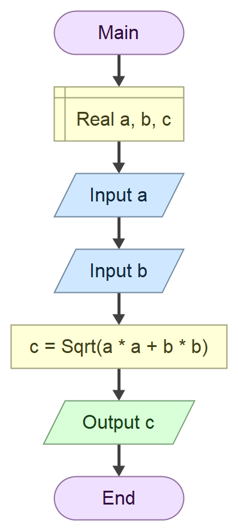

# Domaci zadatak iz tehnicke dokumentacije
## zadatak
Napisi program koji je na osnovu uneta dva realna broja izracunava i ispisuje njihov izbor

$c = √(a² + b²)$

### Algoritamska sema


## Resenje
```cs
using System;

namespace Pitagora
{
    class Program
    {
        static void Main(string[] args)
        {
            Console.Write("Unesi a: ");
            double a = double.Parse(Console.ReadLine());

            Console.Write("Unesi b: ");
            double b = double.Parse(Console.ReadLine());

            double c = Math.Sqrt(a * a + b * b);

            Console.WriteLine($"c = {c}");
            Console.ReadKey();
        }
    }
}
```
### Test primeri
Test primer 1:
``` text
Unesi a: 7
Unesi b: 6
c = 9.21954445729289

C:\Users\radlovacki-05\Desktop\tesla\domaci\domaci\bin\Debug\domaci.exe (process 5192) exited with code 0 (0x0).
Press any key to close this window . . .
```
Test primer 2:
``` text
Unesi a: 3.21
Unesi b: 5.67
c = 6.51559667260029

C:\Users\radlovacki-05\Desktop\tesla\domaci\domaci\bin\Debug\domaci.exe (process 9896) exited with code 0 (0x0).
Press any key to close this window . . .
```
### Objekti

| Redni broj | Promenljiva  | Tip Promenljive|                |
|-------------|------|----------------------- |
| 1.           | `a` | `double`                  |
| 2.          | `b` | `double`                  |
| 3.           | `c` | `double`                  |

